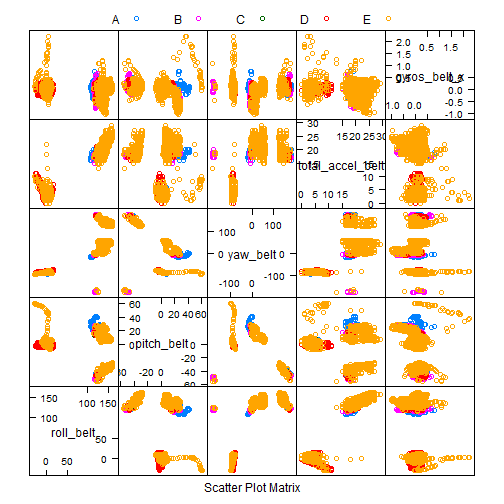

Practical Machine Learningg
========================================================
## Course Project
By Daniel Perez

#Introduction
Using devices such as Jawbone Up, Nike FuelBand, and Fitbit it is now possible to collect a large amount of data about personal activity relatively inexpensively. These type of devices are part of the quantified self movement - a group of enthusiasts who take measurements about themselves regularly to improve their health, to find patterns in their behavior, or because they are tech geeks. One thing that people regularly do is quantify how much of a particular activity they do, but they rarely quantify how well they do it. 

Ourg goal is to use data from accelerometers on the belt, forearm, arm, and dumbell of 6 participants to create a model that can correctly predict how well an individual is doing an activity based on the input of said devices. 

The data was gathered after the participants were asked to perform barbell lifts correctly and incorrectly in 5 different ways. More information is available from the website here: http://groupware.les.inf.puc-rio.br/har. 

#Cleaning and processing the data.

To build the model we will need to load some libraries.


```r
library(xtable)
library(dplyr)
library(ggplot2)
library(caret)
library(rpart)
library(randomForest)
```

Next let's set the seed to ensure reproducibility.


```r
set.seed(2015)
```

We'll have to download the files (stored as a csv) and load them as data frames **preTrain** and **preTest** for unprocessed Training and Test data. We will consider *empty* values, *NA*s and *#DIV/0!* as NA values.


```r
trainDataURL<- "https://d396qusza40orc.cloudfront.net/predmachlearn/pml-training.csv"
download.file(trainDataURL, destfile = "./Data/pml-training.csv")
```

```
## Error in download.file(trainDataURL, destfile = "./Data/pml-training.csv"): unsupported URL scheme
```

```r
testDataURL <- "https://d396qusza40orc.cloudfront.net/predmachlearn/pml-testing.csv"
download.file(testDataURL, destfile = "./Data/pml-testing.csv")
```

```
## Error in download.file(testDataURL, destfile = "./Data/pml-testing.csv"): unsupported URL scheme
```

```r
preTrain <- read.csv("./Data/pml-training.csv", na.strings=c("NA","#DIV/0!", ""))
preTest <- read.csv("./Data/pml-testing.csv", na.strings=c("NA","#DIV/0!", ""))
```

Let's see if there are any columns with a considerable amount of NA values. The more NA values we have in our data, the more we will have to impute and the more our results may differ from the actual population. We will consider a column (*predictor*) as having too many NAs whenever the percentage of NAs is above 50%.


```r
#kable(sapply(preTrain, function(x) {sum(is.na(x))/dim(preTrain)[1]*100}))
percentageOfNAs <- colSums(is.na(preTrain))/dim(preTrain)[1]*100
as.table(percentageOfNAs)[sample(x=1:dim(preTrain)[2], size=20, replace=FALSE)]
```

```
##                 yaw_belt         min_roll_forearm                  yaw_arm 
##                  0.00000                 97.93089                  0.00000 
##           cvtd_timestamp           min_pitch_belt         stddev_pitch_arm 
##                  0.00000                 97.93089                 97.93089 
##              max_yaw_arm       kurtosis_roll_belt amplitude_pitch_dumbbell 
##                 97.93089                 97.98186                 97.93089 
##             min_roll_arm        var_roll_dumbbell              var_yaw_arm 
##                 97.93089                 97.93089                 97.93089 
##         magnet_forearm_x              gyros_arm_y       var_pitch_dumbbell 
##                  0.00000                  0.00000                 97.93089 
##   skewness_pitch_forearm             gyros_belt_z         total_accel_belt 
##                 98.36408                  0.00000                  0.00000 
##         accel_dumbbell_x            avg_pitch_arm 
##                  0.00000                 97.93089
```

```r
sum(percentageOfNAs >= 50)
```

```
## [1] 100
```

There are *100* predictors with a majority of NAs.

Let's clean the dataset by removing other columns that won't contribute to our model.

* Let's remove columns that pertain to data aqcuisition (*row ids*, *timestamps*, etc.).

```r
train <- preTrain[,-c(1,2,3,4,5,6,7)]
```
* Now we shall remove the columns with a significant amount of NAs.

```r
train <- train[,!(colSums(is.na(train))/dim(train)[1]*100 > 50)]
```
* Finally to speed up our training, let's identify those columns that offer little to no variation and remove them from the dataset.

```r
train <- train[,-(nearZeroVar(preTrain))]
```

Now that we have cleaned the training data set, we should make sure that the test data set has the same columns as the training one.

```r
test <- preTest[,as.vector(names(train))]
```

While removing the columns with little variation from the training data set, we removed the **classe** variable which is what we want to predict so now we have to add it.

```r
train$classe <- preTrain$classe
```

#Cross validation.
To cross validate our model, we will have to split our training data set. This will ensure that our model generalizes well and does not suffer from overfitting (*low-variance*).

The training data set will be split into training (*tr*) and a cross-validating (*cr*) datasets holding 70% and 30% of the training data respectively.


```r
t <- createDataPartition(y = train$classe, p=0.7, list=FALSE)
tr <- train[t,]
cv <- train[-t,]
```

#Building a model. 
Let's the *random forest* Machine Learning algorithm to create our model. Since there's a lot of data and our algorithm works by generating a bunch of decision trees (*bagging*), we expect the training time to be lengthy. Let's try to reduce the time by allowing parallel computation.


```r
mfrf <- train(classe ~ ., data = tr, method = "rf", 
              prof = TRUE, 
              trControl = trainControl(method = "cv", number = 4, allowParallel = TRUE))
mfrf$finalModel
```

```
## 
## Call:
##  randomForest(x = x, y = y, mtry = param$mtry, prof = TRUE) 
##                Type of random forest: classification
##                      Number of trees: 500
## No. of variables tried at each split: 24
## 
##         OOB estimate of  error rate: 0.81%
## Confusion matrix:
##      A    B    C    D    E class.error
## A 3900    4    2    0    0 0.001536098
## B   21 2626   11    0    0 0.012039127
## C    0   14 2374    8    0 0.009181970
## D    0    2   27 2222    1 0.013321492
## E    0    0    8    8 1884 0.008421053
```

From the model we can get the five predictors that contribute with the most variance. Let's plot them on a feature plot and see if there's any trend.


```r
mainV <- row.names(varImp(mfrf)[[1]])[1:5]

fp <- featurePlot(x = tr[,mainV], y = tr$classe, plot="pairs", auto.key = list(columns = 5))
print(fp)
```

 
Finally, with our model, let's try to predic the values of the cross validation set and compare them with the actual values, creating a confusion matrix.


```r
confusionMatrix(predict(mfrf,cv), cv$classe)
```

```
## Confusion Matrix and Statistics
## 
##           Reference
## Prediction    A    B    C    D    E
##          A 1671    8    0    0    0
##          B    2 1127    3    0    3
##          C    0    4 1018    9   22
##          D    0    0    5  955    0
##          E    1    0    0    0 1057
## 
## Overall Statistics
##                                           
##                Accuracy : 0.9903          
##                  95% CI : (0.9875, 0.9927)
##     No Information Rate : 0.2845          
##     P-Value [Acc > NIR] : < 2.2e-16       
##                                           
##                   Kappa : 0.9877          
##  Mcnemar's Test P-Value : NA              
## 
## Statistics by Class:
## 
##                      Class: A Class: B Class: C Class: D Class: E
## Sensitivity            0.9982   0.9895   0.9922   0.9907   0.9769
## Specificity            0.9981   0.9983   0.9928   0.9990   0.9998
## Pos Pred Value         0.9952   0.9930   0.9668   0.9948   0.9991
## Neg Pred Value         0.9993   0.9975   0.9983   0.9982   0.9948
## Prevalence             0.2845   0.1935   0.1743   0.1638   0.1839
## Detection Rate         0.2839   0.1915   0.1730   0.1623   0.1796
## Detection Prevalence   0.2853   0.1929   0.1789   0.1631   0.1798
## Balanced Accuracy      0.9982   0.9939   0.9925   0.9948   0.9883
```
As we can see the accuracy is *0.9901444*.

Now we can go on and use this model to predict future values when given a set of predictors.
